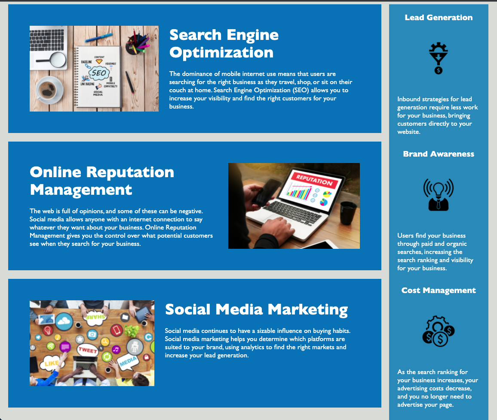

# Code Refactor Starter Code

* Given the project Horiseon, the goal for the project is to follow the client's mock-up. However, the project itself needs to be cleaned up, and the following details were done:

* a. Source code with semantic HTML elements

* b. The HTML follows the logical structure, independent of styling and possitioning
* c. All images include accessible alt attributes
* d. Heading attributes follow the sequential order
* e. The HTML has the concise title
* f. All <e> links function properly
* g. CSS file was properly consolidated and commented, however, without chaning the client's mock-up

# Assets

[The link to deployed application is here:] (https://khanhlam90.github.io/Project-Refactor-Horiseon/)

The following image demonstrates the web application's appearance and functionality:

